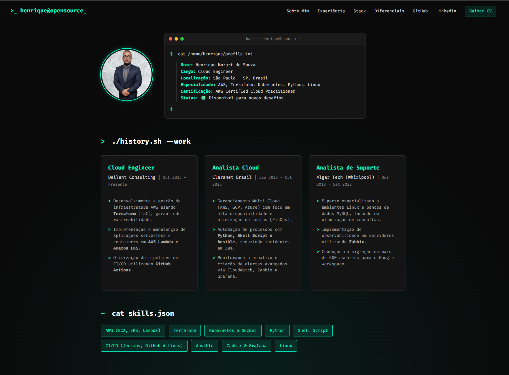
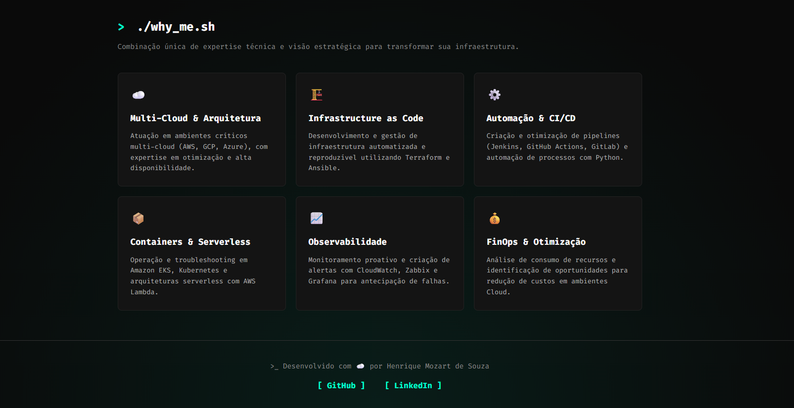

# 👨‍💻 Terminal Portfolio

Um portfólio interativo e responsivo com interface inspirada em terminais de linha de comando. Desenvolvido para apresentar habilidades, projetos e currículo de forma técnica e direta.

## 🚀 Sobre o Projeto

Este projeto foi construído para ser mais do que apenas uma página estática. Ele utiliza um backend em Python (Flask) para gerenciar rotas e downloads, e foi arquitetado pensando em boas práticas de deploy em ambientes de nuvem. O visual simula um ambiente de terminal clássico, focado na experiência de usuários técnicos, recrutadores e engenheiros.

A arquitetura do projeto foi desenhada para facilitar o desenvolvimento contínuo e a implantação, utilizando **Docker Multi-stage Build** com base em **Alpine Linux** para garantir uma imagem final otimizada e executada com o princípio do menor privilégio.

### ✨ Funcionalidades
- Interface "Dark Mode" estilo terminal (hacker theme).
- Renderização dinâmica de páginas com Flask.
- Seção dedicada para download de currículo (PDF).
- Containerização (Docker) otimizada com Multi-stage, Alpine e non-root user.

---





---

## 🛠️ Tecnologias Utilizadas

**Frontend:** HTML5, CSS3, Fira Code.
**Backend & Infraestrutura:** Python 3, Flask, Gunicorn, Docker (Alpine), AWS EC2 (Amazon Linux), Docker Slim (Hardening & Minification), Nginx (Proxy Reverso), Let's Encrypt (SSL/TLS).

---

## 🌐 Arquitetura e Fluxo de Rede

Para garantir segurança e performance, a aplicação não é exposta diretamente para a internet. O tráfego segue o seguinte fluxo até chegar ao código Python:

1. **DNS & WAF:** O utilizador acede a `hmscloud.online`.
2. **AWS EC2 (Security Group):** O firewall de borda da AWS permite apenas tráfego nas portas 80 (HTTP) e 443 (HTTPS).
3. **Nginx & Let's Encrypt:** Rodando diretamente no sistema operativo (Amazon Linux), o Nginx recebe a requisição. Os certificados SSL/TLS são gerados e geridos automaticamente pelo Let's Encrypt (Certbot), que garante a criptografia ponta-a-ponta. O Nginx abre o tráfego seguro e repassa a requisição limpa para a porta local.
4. **Docker Engine:** Captura o tráfego mapeado e injeta na rede isolada do container.
5. **Gunicorn & Flask:** O Gunicorn gere as threads de requisição e o Flask renderiza a página final.

---

## 📂 Estrutura do Projeto

Abaixo está a organização das pastas e arquivos deste repositório:

```py
meu_portfolio/
├── Dockerfile              # Configuração da imagem Docker (Multi-stage + Alpine)
├── .dockerignore           # Arquivos ignorados pelo Docker na hora do build
├── .gitignore              # Arquivos ignorados pelo Git
├── app.py                  # Arquivo principal (servidor Flask)
├── requirements.txt        # Dependências do projeto Python
├── static/                 # Arquivos estáticos (CSS, imagens, documentos)
│   ├── css/
│   │   └── style.css       # Estilos do tema terminal
│   ├── img/
│   │   └── foto_perfil.jpg # Foto de perfil
│   └── docs/
│       └── curriculo.pdf   # Currículo para download
└── templates/              # Arquivos HTML
    └── index.html          # Página principal
```

## 🏗️ Arquitetura Docker (Multi-stage Alpine)

Para garantir máxima performance e redução de custos na AWS, a imagem Docker foi construída em duas etapas (Multi-stage):
1. **Etapa de Build (Builder):** Usa uma imagem Python padrão para baixar e compilar as dependências do `requirements.txt`.
2. **Etapa de Produção (Runtime):** Usa a imagem **Python Alpine** (extremamente leve). Ela apenas copia as dependências já compiladas da etapa 1 e o código fonte. Isso descarta ferramentas de compilação desnecessárias, resultando em uma imagem final de poucos MBs e com menor superfície de ataque.

## 💻 Como rodar o projeto (Docker)

O ambiente foi projetado para rodar primariamente via Docker, garantindo paridade total entre o seu computador e o servidor de produção (AWS EC2).

### Passo 1: Pré-requisitos (Ambiente de Desenvolvimento Local)

Para o seu computador local (Ubuntu), onde o código será criado e testado, precisamos do ecossistema Python para testes rápidos e do Docker para empacotar a aplicação.
*(Nota: HTML, CSS e JavaScript não requerem instalação prévia, pois são nativos do navegador).*

1. Instale o Git e as ferramentas do Python:

```bash
sudo apt update
sudo apt install git python3 python3-pip python3-venv -y
```

2. Instale o Docker (Versão Oficial) para testar a criação da imagem localmente:

```bash
sudo apt-get install ca-certificates curl
sudo install -m 0755 -d /etc/apt/keyrings
sudo curl -fsSL https://download.docker.com/linux/ubuntu/gpg -o /etc/apt/keyrings/docker.asc
sudo chmod a+r /etc/apt/keyrings/docker.asc
echo "deb [arch=$(dpkg --print-architecture) signed-by=/etc/apt/keyrings/docker.asc] https://download.docker.com/linux/ubuntu $(. /etc/os-release && echo "$VERSION_CODENAME") stable" | sudo tee /etc/apt/sources.list.d/docker.list > /dev/null
sudo apt-get update
sudo apt-get install docker-ce docker-ce-cli containerd.io docker-buildx-plugin docker-compose-plugin -y
```
---

### Passo 1.1: Pré-requisitos (Ambiente de Produção - AWS EC2 com Amazon Linux)

A grande vantagem da nossa arquitetura com Docker é que o servidor final (EC2) se mantém extremamente limpo. **Não é necessário instalar o Python ou configurar servidores web diretamente no sistema operacional da máquina.**

1. Atualize os pacotes do sistema:
`sudo yum update -y`

2. Instale o Git e o Docker:
`sudo yum install git docker -y`

3. Inicie o serviço do Docker e garanta que ele ligue automaticamente caso a EC2 seja reiniciada:
`sudo systemctl start docker`
`sudo systemctl enable docker`

4. (Opcional) Adicione o usuário padrão da AWS (`ec2-user`) ao grupo docker para não precisar usar 'sudo' em todos os comandos:
`sudo usermod -aG docker ec2-user`
*(Nota: Você precisará sair e entrar novamente na conexão SSH para essa permissão fazer efeito).*

### Passo 1.2: Instalação do Docker Slim (Ferramenta de Senioridade)
Para atingir o estado de "Zero-Payload" e segurança máxima, utilizamos o Docker Slim para analisar dinamicamente o container e remover binários desnecessários (como shells e pacotes de gerenciamento).

```bash
# Baixar o binário oficial (Linux)
curl -L [https://raw.githubusercontent.com/slimtoolkit/slim/master/scripts/install-slim.sh](https://raw.githubusercontent.com/slimtoolkit/slim/master/scripts/install-slim.sh) | sudo bash
```

### Passo 2: Clonar o repositório
Baixe o código-fonte para a sua máquina:
`git clone git@github.com:henrique-mozart-de-souza/meu_portfolio.git`
`cd meu_portfolio`

### Passo 3: Construir a imagem Docker mínima (Multi-stage + Dynamic Analysis (Slim))

Nosso pipeline de build segue o padrão de **Defesa em Profundidade**:
1. **Builder:** Compila dependências.
2. **Runtime (Alpine):** Cria a imagem funcional (aprox. 98MB).
3. **Hardening (Slim):** O Docker Slim executa uma "sonda" (http-probe) no container, identifica quais arquivos são realmente acessados pelo Flask e remove todo o restante, incluindo o Shell (`/bin/sh`), dificultando movimentações laterais em caso de invasão.

# 1. Build da imagem funcional
`sudo docker build -t meu-portfolio-flask:latest .`

# 2. Minificação e Hardening com Probing Ativo
# O comando abaixo abre o container, testa a rota '/' e gera a imagem final
```bash
sudo slim build \
  --target meu-portfolio-flask:latest \
  --tag meu-portfolio-flask:slim \
  --http-probe-retry-count 5 \
  --http-probe-retry-wait 5 \
  --http-probe-cmd / \
  --http-probe-cmd /download-cv
```

#### Passo 3.1: requirements.txt
<details>
<summary>👉 Exibir </summary>

```Plaintext
Flask==3.0.2
gunicorn==21.2.0
```
</details>

#### Passo 3.2: Dockerfile
<details>
<summary>👉 Exibir </summary>

```Dockerfile
# ETAPA 1: Builder (Compila as dependências)
FROM python:3.12-alpine AS builder

WORKDIR /app
COPY requirements.txt .

# Cria os pacotes (wheels) para não precisar compilar no runtime
RUN pip wheel --no-cache-dir --no-deps --wheel-dir /app/wheels -r requirements.txt


# ETAPA 2: Runtime (Imagem final super leve e segura)
FROM python:3.12-alpine

# Segurança: Cria um grupo e um usuário sem privilégios de root
RUN addgroup -S appgroup && adduser -S appuser -G appgroup

WORKDIR /app

# Copia os pacotes compilados da etapa anterior e instala
COPY --from=builder /app/wheels /wheels
COPY --from=builder /app/requirements.txt .
RUN pip install --no-cache /wheels/*

# Copia o código fonte do projeto
COPY . .

# Segurança: Muda a propriedade dos arquivos para o novo usuário
RUN chown -R appuser:appgroup /app

# Segurança: Define o usuário restrito para rodar a aplicação daqui em diante
USER appuser

# Expõe a porta que o Gunicorn vai usar
EXPOSE 5000

# Inicia o servidor web Gunicorn
CMD ["gunicorn", "-w", "2", "-b", "0.0.0.0:5000", "app:app"]
```
</details>

#### Passo 3.3: app.py
<details>
<summary>👉 Exibir </summary>

```Python
from flask import Flask, render_template, send_from_directory
import os

app = Flask(__name__)

# Rota principal (Página inicial)
@app.route('/')
def index():
    return render_template('index.html')

# Rota para baixar o currículo
@app.route('/download-cv')
def download_cv():
    # Caminho para a pasta onde o PDF está salvo
    pasta_docs = os.path.join(app.root_path, 'static', 'docs')
    # Retorna o arquivo como um anexo para download
    return send_from_directory(directory=pasta_docs, path='curriculo.pdf', as_attachment=True)

if __name__ == '__main__':
    # Roda em modo debug apenas quando executado diretamente (sem Gunicorn)
    app.run(debug=True, host='0.0.0.0', port=5000)
```
</details>

#### Passo 3.4: templates/index.html
<details>
<summary>👉 Exibir </summary>

```HTML
<!DOCTYPE html>
<html lang="pt-BR">
<head>
    <meta charset="UTF-8">
    <meta name="viewport" content="width=device-width, initial-scale=1.0">
    <title>>_ henrique@opensource</title>
    <link rel="stylesheet" href="{{ url_for('static', filename='css/style.css') }}">
    <link href="https://fonts.googleapis.com/css2?family=Fira+Code:wght@300;400;500;700&display=swap" rel="stylesheet">
</head>
<body>
    <header>
        <div class="logo">>_ henrique@opensource_</div>
        <nav>
            <a href="#sobre">Sobre Mim</a>
            <a href="#experiencia">Experiência</a>
            <a href="#skills">Stack</a>
            <a href="#diferenciais">Diferenciais</a>
            <a href="https://github.com/henrique-mozart-de-souza" target="_blank">GitHub</a>
            <a href="https://www.linkedin.com/in/henrique-mozart-de-souza-b3697b6b/" target="_blank">LinkedIn</a>
            <a href="/download-cv" class="btn-cv">Baixar CV</a>
        </nav>
    </header>

    <main>
        <section id="sobre" class="section-container" style="max-width: 1100px; text-align: left; margin-top: 40px;">
            <div class="hero-content">
                <div class="profile-container">
                    
                </div>
                
                <div class="terminal-window">
                    <div class="terminal-header">
                        <span class="dot red"></span>
                        <span class="dot yellow"></span>
                        <span class="dot green"></span>
                        <span class="terminal-title">bash - henrique@ubuntu: ~</span>
                    </div>
                    <div class="terminal-body">
                        <p><span class="prompt">$</span> cat /home/henrique/profile.txt</p>
                        <div class="terminal-output">
                            <p><span class="highlight">Nome:</span> Henrique Mozart de Souza</p>
                            <p><span class="highlight">Cargo:</span> Cloud Engineer</p>
                            <p><span class="highlight">Localização:</span> São Paulo - SP, Brasil</p>
                            <p><span class="highlight">Especialidade:</span> AWS, Terraform, Kubernetes, Python, Linux</p>
                            <p><span class="highlight">Certificação:</span> AWS Certified Cloud Practitioner</p>
                            <p><span class="highlight">Status:</span> 🟢 Disponível para novos desafios</p>
                        </div>
                        <p><span class="prompt">$</span> <span class="cursor">_</span></p>
                    </div>
                </div>
            </div>
        </section>

        <section id="experiencia" class="section-container" style="max-width: 1100px;">
            <h2 style="text-align: left;"><span class="prompt">></span> ./history.sh --work</h2>
            
            <div class="grid-experiencia">
                <div class="card-exp">
                    <h3>Cloud Engineer</h3>
                    <h4>Dellent Consulting <span>| Out 2025 - Presente</span></h4>
                    <ul>
                        <li>Desenvolvimento e gestão de infraestrutura AWS usando <strong>Terraform</strong> (IaC), garantindo rastreabilidade.</li>
                        <li>Implementação e manutenção de aplicações serverless e containers em <strong>AWS Lambda e Amazon EKS</strong>.</li>
                        <li>Otimização de pipelines de CI/CD utilizando <strong>GitHub Actions</strong>.</li>
                    </ul>
                </div>

                <div class="card-exp">
                    <h3>Analista Cloud</h3>
                    <h4>Claranet Brasil <span>| Jan 2023 - Out 2025</span></h4>
                    <ul>
                        <li>Gerenciamento Multi-Cloud (AWS, GCP, Azure) com foco em alta disponibilidade e otimização de custos (FinOps).</li>
                        <li>Automação de processos com <strong>Python, Shell Script e Ansible</strong>, reduzindo incidentes em 30%.</li>
                        <li>Monitoramento proativo e criação de alertas avançados via CloudWatch, Zabbix e Grafana.</li>
                    </ul>
                </div>

                <div class="card-exp">
                    <h3>Analista de Suporte</h3>
                    <h4>Algar Tech (Whirlpool) <span>| Out 2013 - Set 2022</span></h4>
                    <ul>
                        <li>Suporte especializado a ambientes Linux e bancos de dados MySQL, focando em otimização de consultas.</li>
                        <li>Implementação de observabilidade em servidores utilizando <strong>Zabbix</strong>.</li>
                        <li>Condução da migração de mais de 600 usuários para o Google Workspace.</li>
                    </ul>
                </div>
            </div>
        </section>

        <section id="skills" class="section-container" style="max-width: 1100px;">
            <h2 style="text-align: left;"><span class="prompt">~</span> cat skills.json</h2>
            <div class="skills-container">
                <span class="skill-badge">AWS (EC2, EKS, Lambda)</span>
                <span class="skill-badge">Terraform</span>
                <span class="skill-badge">Kubernetes & Docker</span>
                <span class="skill-badge">Python</span>
                <span class="skill-badge">Shell Script</span>
                <span class="skill-badge">CI/CD (Jenkins, GitHub Actions)</span>
                <span class="skill-badge">Ansible</span>
                <span class="skill-badge">Zabbix & Grafana</span>
                <span class="skill-badge">Linux</span>
            </div>
        </section>

        <section id="diferenciais" class="section-container" style="max-width: 1100px; margin-top: 80px;">
            <h2 style="text-align: left;"><span class="prompt">></span> ./why_me.sh</h2>
            <p class="subtitle" style="text-align: left;">Combinação única de expertise técnica e visão estratégica para transformar sua infraestrutura.</p>
            
            <div class="grid-cards">
                <div class="card">
                    <span class="icon">☁️</span>
                    <h3>Multi-Cloud & Arquitetura</h3>
                    <p>Atuação em ambientes críticos multi-cloud (AWS, GCP, Azure), com expertise em otimização e alta disponibilidade.</p>
                </div>
                <div class="card">
                    <span class="icon">🏗️</span>
                    <h3>Infrastructure as Code</h3>
                    <p>Desenvolvimento e gestão de infraestrutura automatizada e reproduzível utilizando Terraform e Ansible.</p>
                </div>
                <div class="card">
                    <span class="icon">⚙️</span>
                    <h3>Automação & CI/CD</h3>
                    <p>Criação e otimização de pipelines (Jenkins, GitHub Actions, GitLab) e automação de processos com Python.</p>
                </div>
                <div class="card">
                    <span class="icon">📦</span>
                    <h3>Containers & Serverless</h3>
                    <p>Operação e troubleshooting em Amazon EKS, Kubernetes e arquiteturas serverless com AWS Lambda.</p>
                </div>
                <div class="card">
                    <span class="icon">📈</span>
                    <h3>Observabilidade</h3>
                    <p>Monitoramento proativo e criação de alertas com CloudWatch, Zabbix e Grafana para antecipação de falhas.</p>
                </div>
                <div class="card">
                    <span class="icon">💰</span>
                    <h3>FinOps & Otimização</h3>
                    <p>Análise de consumo de recursos e identificação de oportunidades para redução de custos em ambientes Cloud.</p>
                </div>
            </div>
        </section>
    </main>

    <footer>
        <p>>_ Desenvolvido com ☁️ por Henrique Mozart de Souza</p>
        <div class="footer-links">
            <a href="https://github.com/henrique-mozart-de-souza" target="_blank">[ GitHub ]</a>
            <a href="https://www.linkedin.com/in/henrique-mozart-de-souza-b3697b6b/" target="_blank">[ LinkedIn ]</a>
        </div>
    </footer>
</body>
</html>
```
</details>

#### Passo 3.5: static/css/style.css
<details>
<summary>👉 Exibir </summary>

```CSS
/* Variáveis de Cores */
:root {
    --bg-color: #0a0a0a;
    --card-bg: #141414;
    --text-color: #e0e0e0;
    --neon-green: #00ffcc;
    --neon-green-dim: rgba(0, 255, 204, 0.1);
}

* {
    margin: 0;
    padding: 0;
    box-sizing: border-box;
}

body {
    background-color: var(--bg-color);
    background-image: radial-gradient(circle at 50% 100%, rgba(0, 255, 204, 0.08) 0%, var(--bg-color) 60%);
    background-attachment: fixed;
    color: var(--text-color);
    font-family: 'Fira Code', monospace;
    line-height: 1.6;
    min-height: 100vh;
}

/* --- Header & Navegação --- */
header {
    display: flex;
    justify-content: space-between;
    align-items: center;
    padding: 20px 50px;
    border-bottom: 1px solid #333;
}

.logo {
    color: var(--neon-green);
    font-weight: 700;
    font-size: 1.2rem;
}

nav a {
    color: var(--text-color);
    text-decoration: none;
    margin-left: 20px;
    font-size: 0.9rem;
    transition: color 0.3s;
}

nav a:hover {
    color: var(--neon-green);
}

.btn-cv {
    background-color: var(--neon-green-dim);
    border: 1px solid var(--neon-green);
    color: var(--neon-green);
    padding: 8px 15px;
    border-radius: 4px;
}

.btn-cv:hover {
    background-color: var(--neon-green);
    color: var(--bg-color);
}

/* --- Seções Gerais --- */
.section-container {
    max-width: 1000px;
    margin: 60px auto;
    text-align: center;
    padding: 0 20px;
}

h2 {
    color: white;
    margin-bottom: 10px;
}

.subtitle {
    color: #888;
    margin-bottom: 40px;
    font-size: 0.9rem;
}

/* --- Introdução: Lado a Lado (Foto e Terminal) --- */
.hero-content {
    display: flex;
    align-items: center;
    justify-content: flex-start;
    gap: 40px;
    flex-wrap: wrap;
}

.profile-container {
    flex-shrink: 0;
}

.profile-pic {
    width: 180px;
    height: 180px;
    border-radius: 50%;
    object-fit: cover;
    border: 4px solid var(--card-bg); 
    outline: 2px solid var(--neon-green);
    box-shadow: 0 0 15px rgba(0, 255, 204, 0.4);
    transition: transform 0.3s ease, box-shadow 0.3s ease;
}

.profile-pic:hover {
    transform: scale(1.05);
    box-shadow: 0 0 25px rgba(0, 255, 204, 0.7);
}

/* --- Janela de Terminal --- */
.terminal-window {
    background-color: var(--card-bg);
    border-radius: 8px;
    border: 1px solid #333;
    overflow: hidden;
    text-align: left;
    width: 100%;
    max-width: 700px;
    margin: 0;
    flex-grow: 1;
}

.terminal-header {
    background-color: #1a1a1a;
    padding: 10px 15px;
    display: flex;
    align-items: center;
    border-bottom: 1px solid #333;
}

.dot {
    width: 12px;
    height: 12px;
    border-radius: 50%;
    margin-right: 8px;
}

.dot.red { background-color: #ff5f56; }
.dot.yellow { background-color: #ffbd2e; }
.dot.green { background-color: #27c93f; }

.terminal-title {
    color: #888;
    font-size: 0.8rem;
    margin-left: auto;
    margin-right: auto;
}

.terminal-body {
    padding: 20px;
    font-size: 0.9rem;
}

.prompt { color: var(--neon-green); margin-right: 10px; }
.highlight { color: var(--neon-green); font-weight: bold; }
.terminal-output { margin: 15px 0 15px 20px; border-left: 2px solid #333; padding-left: 15px; }

.cursor {
    display: inline-block;
    width: 8px;
    background-color: var(--neon-green);
    animation: blink 1s step-end infinite;
}

@keyframes blink {
    0%, 100% { opacity: 1; }
    50% { opacity: 0; }
}

/* --- Seção de Hard Skills --- */
.skills-container {
    display: flex;
    flex-wrap: wrap;
    gap: 12px;
    margin-top: 20px;
    justify-content: flex-start;
}

.skill-badge {
    background-color: var(--neon-green-dim);
    color: var(--neon-green);
    border: 1px solid var(--neon-green);
    padding: 8px 16px;
    border-radius: 4px;
    font-size: 0.9rem;
    transition: all 0.3s ease;
    cursor: default;
}

.skill-badge:hover {
    background-color: var(--neon-green);
    color: var(--bg-color);
    box-shadow: 0 0 10px rgba(0, 255, 204, 0.5);
}

/* --- Grid de Experiência --- */
.grid-experiencia {
    display: grid;
    grid-template-columns: repeat(auto-fit, minmax(320px, 1fr));
    gap: 25px;
    margin-top: 30px;
}

.card-exp {
    background-color: var(--card-bg);
    border: 1px solid #222;
    padding: 25px;
    border-radius: 8px;
    text-align: left;
    transition: border-color 0.3s, transform 0.3s;
    border-top: 3px solid #333;
}

.card-exp:hover {
    border-color: var(--neon-green);
    border-top: 3px solid var(--neon-green);
    transform: translateY(-5px);
}

.card-exp h3 {
    color: var(--neon-green);
    font-size: 1.2rem;
    margin-bottom: 5px;
}

.card-exp h4 {
    color: #e0e0e0;
    font-size: 0.95rem;
    font-weight: 400;
    margin-bottom: 20px;
    padding-bottom: 15px;
    border-bottom: 1px dashed #333;
}

.card-exp h4 span {
    color: #888;
    font-size: 0.85rem;
}

.card-exp ul {
    list-style-type: none;
    padding-left: 0;
}

.card-exp ul li {
    color: #aaa;
    font-size: 0.9rem;
    margin-bottom: 12px;
    padding-left: 18px;
    position: relative;
    line-height: 1.5;
}

.card-exp ul li::before {
    content: ">";
    color: var(--neon-green);
    position: absolute;
    left: 0;
    font-weight: bold;
}

/* --- Cards de Diferenciais (Why Me) --- */
.grid-cards {
    display: grid;
    grid-template-columns: repeat(auto-fit, minmax(300px, 1fr));
    gap: 20px;
    margin-top: 20px; /* Adicionado um espaçamento superior */
}

.card {
    background-color: var(--card-bg);
    padding: 25px;
    border-radius: 8px;
    border: 1px solid #222;
    text-align: left;
    transition: transform 0.3s, border-color 0.3s;
}

.card:hover {
    transform: translateY(-5px);
    border-color: var(--neon-green);
}

.card .icon {
    font-size: 1.5rem;
    margin-bottom: 15px;
    display: block;
}

.card h3 {
    color: white;
    font-size: 1.1rem;
    margin-bottom: 10px;
}

.card p {
    color: #aaa;
    font-size: 0.85rem;
}

/* --- Rodapé (Footer) --- */
footer {
    text-align: center;
    padding: 40px 20px;
    border-top: 1px solid #333;
    margin-top: 60px;
}

footer p {
    color: #888;
    font-size: 0.9rem;
}

.footer-links {
    margin-top: 15px;
}

.footer-links a {
    color: var(--neon-green);
    text-decoration: none;
    margin: 0 15px;
    font-weight: bold;
    transition: color 0.3s, text-shadow 0.3s;
}

.footer-links a:hover {
    color: var(--text-color);
    text-shadow: 0 0 8px var(--neon-green);
}
```
</details>

### Passo 4: Executar o container
Rode a aplicação mapeando a porta local 5000 para a 5000 do container (o Nginx fará a ponte da porta 80/443 para a 5000):
`sudo docker run -d -p 5000:5000 --name portfolio meu-portfolio-flask`

### Passo 5: Configurar o Nginx (Proxy Reverso na EC2)
Para expor a aplicação de forma segura através do domínio `hmscloud.online`:

1. Instale e inicie o Nginx no Amazon Linux:
`sudo yum install nginx -y`
`sudo systemctl start nginx`
`sudo systemctl enable nginx`

2. Crie o arquivo de configuração do seu domínio:
`sudo nano /etc/nginx/conf.d/portfolio.conf`

3. Insira o bloco de proxy reverso (adaptado para o seu domínio):
```nginx
server {
    listen 80;
    server_name hmscloud.online www.hmscloud.online;

    location / {
        proxy_pass [http://127.0.0.1:5000](http://127.0.0.1:5000);
        proxy_set_header Host $host;
        proxy_set_header X-Real-IP $remote_addr;
        proxy_set_header X-Forwarded-For $proxy_add_x_forwarded_for;
    }
}
```
### Passo 6: Habilitar HTTPS com Let's Encrypt (Certbot)

Para garantir a segurança criptográfica da sua infraestrutura, aplicaremos o certificado SSL gratuito do Let's Encrypt.

1. Instale o Certbot e o plugin do Nginx (método oficial recomendado via ambiente virtual Python no Amazon Linux):
```bash
sudo python3 -m venv /opt/certbot/
sudo /opt/certbot/bin/pip install --upgrade pip
sudo /opt/certbot/bin/pip install certbot certbot-nginx
sudo ln -s /opt/certbot/bin/certbot /usr/bin/certbot
```

Execute o Certbot. Ele irá validar o domínio e alterar o ficheiro do Nginx automaticamente para suportar HTTPS:
```sudo certbot --nginx -d hmscloud.online -d www.hmscloud.online```

(Opcional) Teste a renovação automática do certificado:
```sudo certbot renew --dry-run```

### Passo 7: (Opcional) Automação de Deploy via AWS User Data (Infraestrutura Imutável)

Para evitar a necessidade de criar e armazenar uma AMI (o que gera custos de snapshot) e garantir que o servidor suba sempre com a versão mais recente do código, você pode automatizar todo o provisionamento inserindo o script abaixo no campo **User Data** ao lançar uma nova instância EC2 (Amazon Linux).

Este script roda com privilégios de `root` no primeiro boot da máquina, instalando dependências, baixando o código, subindo o container e configurando o Nginx automaticamente.

<details>
<summary>👉 Exibir </summary>

```bash
#!/bin/bash

# 0. Aguarda 1 minutos (60 segundos) para inicio de config.
sleep 60

# 1. Atualiza o sistema e instala pacotes essenciais (incluindo bind-utils para o comando dig)
yum update -y
yum install git docker nginx bind-utils -y

# 2. Inicia e habilita serviços (Docker e Nginx)
systemctl start docker
systemctl enable docker
systemctl start nginx
systemctl enable nginx

# 3. Dá permissão do Docker para o ec2-user
usermod -aG docker ec2-user

# 4. Baixa o código do repositório (via HTTPS)
cd /home/ec2-user
git clone [https://github.com/henrique-mozart-de-souza/meu_portfolio.git](https://github.com/henrique-mozart-de-souza/meu_portfolio.git)
cd meu_portfolio
chown -R ec2-user:ec2-user /home/ec2-user/meu_portfolio

# 5. Constrói e roda a aplicação no Docker
docker build -t meu-portfolio-flask .
docker run -d -p 5000:5000 --name portfolio meu-portfolio-flask

# 6. Configura o Nginx como Proxy Reverso (HTTP inicial)
cat <<EOF > /etc/nginx/conf.d/portfolio.conf
server {
    listen 80;
    server_name hmscloud.online www.hmscloud.online;

    location / {
        proxy_pass [http://127.0.0.1:5000](http://127.0.0.1:5000);
        proxy_set_header Host \$host;
        proxy_set_header X-Real-IP \$remote_addr;
        proxy_set_header X-Forwarded-For \$proxy_add_x_forwarded_for;
    }
}
EOF
systemctl restart nginx

# 7. Instala o Certbot (Let's Encrypt)
python3 -m venv /opt/certbot/
/opt/certbot/bin/pip install --upgrade pip
/opt/certbot/bin/pip install certbot certbot-nginx
ln -s /opt/certbot/bin/certbot /usr/bin/certbot

# 8. Loop de Verificação de DNS (Evita falhas do Let's Encrypt)
# Resgata o IP Público atual da EC2 usando IMDSv2 (Padrão de segurança AWS)
TOKEN=\$(curl -X PUT "[http://169.254.169.254/latest/api/token](http://169.254.169.254/latest/api/token)" -H "X-aws-ec2-metadata-token-ttl-seconds: 21600")
MY_IP=\$(curl -H "X-aws-ec2-metadata-token: \$TOKEN" -s [http://169.254.169.254/latest/meta-data/public-ipv4](http://169.254.169.254/latest/meta-data/public-ipv4))

# Aguarda até que o domínio responda com o IP correto desta EC2
while true; do
    DNS_IP=\$(dig +short hmscloud.online | tail -n 1)
    
    if [ "\$MY_IP" == "\$DNS_IP" ]; then
        break # O DNS propagou! Sai do loop para instalar o certificado.
    fi
    
    sleep 60 # Aguarda 1 minuto e tenta novamente
done

# 9. Executa o Certbot automaticamente
certbot --nginx -d hmscloud.online -d www.hmscloud.online --non-interactive --agree-tos -m seu-email@dominio.com

# 10. Reinicia o Nginx para aplicar o SSL definitivo
systemctl restart nginx
```
</details>

## 🔧 Guia Rápido de Debug (Comandos Docker)

Caso precise parar a aplicação, atualizar ou verificar erros (logs do Flask), utilize os comandos abaixo:

- **Listar containers rodando:**
  `sudo docker ps`
- **Listar TODOS os containers (inclusive os parados):**
  `sudo docker ps -a`
- **Parar o portfólio:**
  `sudo docker stop portfolio`
- **Iniciar o portfólio novamente:**
  `sudo docker start portfolio`
- **Remover o container (necessário se for criar um novo com o mesmo nome):**
  `sudo docker rm portfolio` *(O container precisa estar parado)*
- **Remover a image (necessário se for criar um novo com o mesmo nome):**
  `sudo docker image rm meu-portfolio-flask` *(O container precisa estar parado)*
- **Ver os logs da aplicação (útil para ver erros do Python/Flask):**
  `sudo docker logs portfolio`
- **Acompanhar os logs em tempo real:**
  `sudo docker logs -f portfolio`
- **Acessar o terminal de dentro do container (usando `sh` pois é Alpine):**
  `sudo docker exec -it portfolio sh`

---


## 📬 Contato

**Henrique Mozart de Souza**
- LinkedIn: [https://www.linkedin.com/in/henrique-mozart-de-souza-b3697b6b/]

- GitHub: [https://github.com/henrique-mozart-de-souza]

---
Feito com ☕, Python e Docker.
